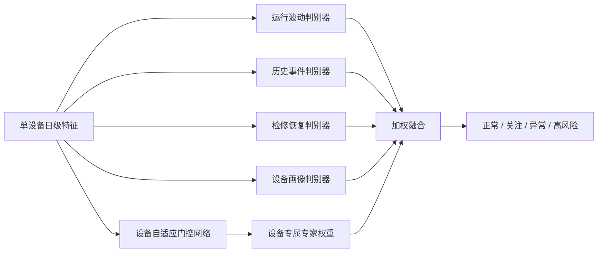

# 设备个性化多判别器模型

## 1. 模型定位

设备个性化多判别器模型的代码名为 `torch_multi_discriminator`，核心类为 `DeviceAdaptiveMultiDiscriminator`。模型面向每一台设备单独生成一组判别器融合权重，使不同设备形成不同的风险识别路径。

该方法不是为 5,729 台设备分别保存 5,729 个完全独立的神经网络。每台设备目前只有约 90 天数据，直接训练独立网络会严重过拟合。项目采用“底层知识共享、设备路径个性化”的方式：所有设备共享四个专业判别器，但每台设备根据自身量测、历史事件、检修状态和家族画像，得到独立的门控权重向量。

对外可以概括为：

> 建立面向单设备的自适应多判别器模型。模型针对每台设备的运行特征和历史画像，动态生成专属判别器权重，在共享行业知识的同时保留设备间的差异性，实现设备级个性化状态识别。

## 2. 模型结构



### 2.1 运行波动判别器

输入电流、电压、有功、无功、频率、开关状态、滚动均值、短期差分和同站同类偏离等特征，重点识别当前运行状态的异常波动。

### 2.2 历史事件判别器

输入历史缺陷数、历史跳闸数、最高事件等级、事件类型和事件原因等特征，重点判断设备历史风险的累积效应。

### 2.3 检修恢复判别器

输入检修次数、未处理缺陷、未处理跳闸、检修关联状态和事件处理完成率等特征，区分“发生过事件但已检修”和“事件尚未有效闭环”的设备。

### 2.4 设备画像判别器

输入设备类型、厂家、电压等级、设备年龄、家族设备缺陷和家族跳闸等特征，描述设备固有属性和同类设备风险背景。

## 3. 每台设备如何形成独立模型

对于设备 `d` 在日期 `t` 的输入特征 `x(d,t)`，门控网络输出四维权重：

```text
g(d,t) = [w_operation, w_history, w_maintenance, w_family]
```

四个权重经过 Softmax 归一化，总和为 1。最终判别结果为：

```text
prediction(d,t) = sum(w_k(d,t) * discriminator_k(x_k(d,t))) + global_residual(x(d,t))
```

同一设备在不同日期可以根据运行状态调整权重。项目再对设备全部日期的权重求均值，得到设备长期专家画像：

```text
device_profile(d) = mean_t(g(d,t))
```

因此，每台设备都有独立的：

- 四判别器权重组合。
- 主导判别器。
- 个性化强度。
- 高风险概率。
- 状态等级与预测置信度。

这套机制能够表达设备差异，但参数规模仍然可控，适合在 RTX 3090 上训练和部署。

## 4. 训练约束

总损失由三部分构成：

```text
总损失 = 加权分类损失 + 专家均衡损失 + 门控置信损失
```

- 加权分类损失用于处理正常、关注、异常和高风险样本不均衡。
- 专家均衡损失防止所有设备都退化为只使用一个判别器。
- 门控置信损失减少长期平均分配，让设备形成更清晰的主导判别路径。

优化器使用 `AdamW`。代码支持 CPU、Apple MPS 和 NVIDIA CUDA，并可以通过 `--gpu-id` 指定 Linux 服务器上的 GPU。

## 5. Quick 实验结果

设备测试集包含 1,433 台训练阶段未见设备：

| 模型 | Accuracy | Macro-F1 | QWK | 高风险召回 |
| --- | ---: | ---: | ---: | ---: |
| 普通 PyTorch MLP | 0.9460 | 0.8632 | 0.9215 | 0.8710 |
| 设备个性化多判别器 | 0.9428 | 0.8142 | 0.9151 | 0.8817 |

多判别器的总体 Macro-F1 略低于普通 MLP，但高风险召回更高。它当前的主要价值是增强设备差异表达、风险解释和高风险筛查，而不是单纯追求最高 Accuracy。

5,729 台设备的专家画像分布为：

| 主导判别器 | 设备数 |
| --- | ---: |
| 设备画像判别器 | 2,833 |
| 检修恢复判别器 | 1,368 |
| 运行波动判别器 | 1,260 |
| 历史事件判别器 | 268 |

设备个性化强度均值为 0.529，标准差为 0.143，范围为 0.298 至 0.987。不同设备的专家权重存在明显差异，四类判别器均被实际使用，未出现所有设备使用同一路径的退化现象。

## 6. 输出文件

```text
outputs/baseline_models/device_prediction/
├── torch_multi_discriminator.pt
├── torch_multi_discriminator_classification_report.csv
├── torch_multi_discriminator_confusion_matrix.csv
├── device_expert_profiles.csv
└── metrics_summary.csv
```

`device_expert_profiles.csv` 每行对应一台设备，包含：

- `unified_device_id`：设备 ID。
- `dominant_discriminator`：主导判别器。
- `expert_weight_*`：四个判别器的平均权重。
- `personalization_strength`：最大判别器权重，越大表示设备判别路径越集中。
- `high_risk_probability`：设备平均高风险概率。
- `prediction_confidence`：预测置信度。
- `data_partition`：设备属于训练集还是跨设备测试集。

## 7. 推荐的项目表达

推荐写法：

> 针对不同电力设备运行机理和历史风险差异，构建设备自适应多判别器网络。模型设置运行波动、历史事件、检修恢复和设备画像四类判别器，并通过门控网络为每台设备动态生成专属融合权重。该结构在共享总体样本知识的同时，为每台设备保留独立风险路径，从而实现设备级差异化状态评估。

不建议写成“每台设备训练一个完全独立神经网络”。目前单设备样本数量不足，这种说法既不符合实现，也容易被质疑过拟合和模型维护成本。

## 8. 后续升级方向

后续保持适度复杂度，优先做三项升级：

1. 接入真实事件日期，训练 D+1 至 D+7 的设备故障目标。
2. 将每台设备最近 7 天和 30 天的状态汇总为设备原型，使门控权重随时间更新。
3. 对高风险设备增加置信度校准和主要触发因素输出，形成设备风险清单。

暂不建议立即叠加大型 Transformer 或复杂图神经网络。当前数据量和标签质量下，多判别器加设备原型已经足够体现技术路线，并且更容易解释和落地。
