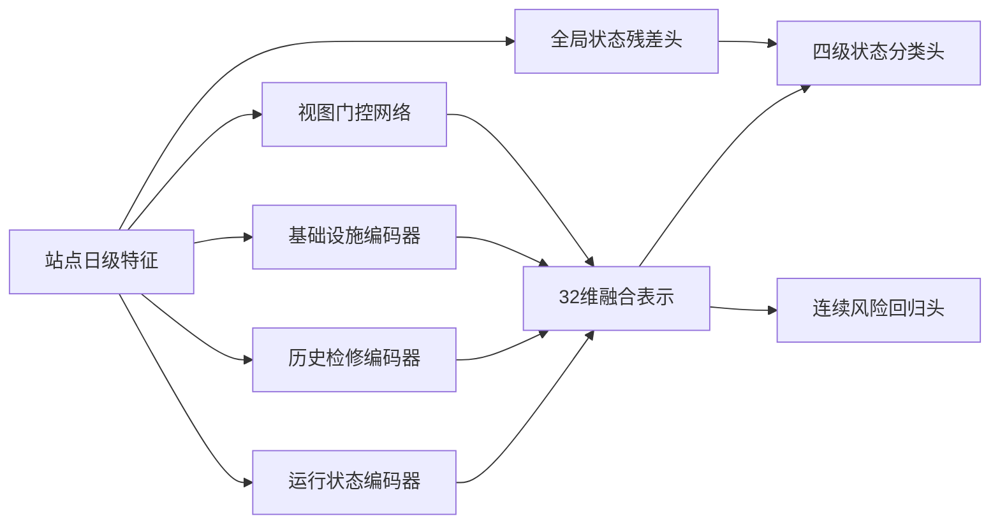

# HSF-Net：站点分层多视角状态融合网络

## 1. 模型定位

站点状态评估模型命名为 HSF-Net（Hierarchical Station Fusion Network），代码名为 `torch_station_hierarchical`，核心类为 `StationHierarchicalFusionNetwork`。

HSF-Net 不只输出一个四级站点标签，而是同时完成两个任务：

1. 输出正常、关注、异常、高风险四级站点状态。
2. 输出 0 至 100 的连续站点风险分。

模型还会给出运行状态、历史检修、基础设施三个视图的融合权重，使站点风险具有可解释来源。

## 2. 问题定义

设备模型关注单台设备，站点模型需要处理更高层级的问题。一个站点的风险不仅取决于某个量测值，还同时受到以下因素影响：

- 当前站内电压、电流、有功、无功和开关状态。
- 站内设备运行数据覆盖率和量测质量。
- 历史缺陷、跳闸、检修和未处理事件。
- 主变数量、主变容量、电压等级和站点类型。
- 雷害风险、冰区等级等环境条件。

直接把所有字段输入单一分类器虽然可以得到标签，但无法区分风险主要来自当前运行、历史事件还是基础设施条件。HSF-Net 将站点特征分成三个业务视图，再进行分层融合。

当前数据包含 77 个站点、90 天记录。Quick 实验使用 4,000 行，按 `station_id` 分组后使用 57 个站点训练、20 个未见站点测试。

## 3. 数据处理与特征

站点数据处理流程为：

```text
日期与站点排序
-> 缺失值处理
-> 数值标准化与类别 One-Hot
-> 电压极差、电流峰均比、功率比和开关动作率
-> 7 日滚动均值与 1 日差分
-> 历史事件、检修覆盖和环境风险特征
-> 形成 49 维模型输入
```

原始建模字段包含 46 个数值特征和 1 个类别特征，One-Hot 后得到 49 维输入。

### 3.1 运行状态视图

运行视图包含 32 维特征，主要包括：

- 运行设备数和数据覆盖率。
- 电压均值、最大值、最小值和电压极差。
- 电流均值、最大值和峰均比。
- 有功、无功、功率比和容量负载代理值。
- 开关动作率、滚动统计和短期变化。

### 3.2 历史检修视图

历史检修视图包含 8 维特征：

- 历史缺陷数、跳闸数和事件总数。
- 历史检修数。
- 未处理事件代理数。
- 检修覆盖率代理值。
- 单台主变历史事件数。

### 3.3 基础设施视图

基础设施视图包含 9 维特征：

- 站点类型与电压等级。
- 主变数量与主变容量。
- 雷害风险和冰区等级。
- 综合环境风险等级。

## 4. 网络结构



### 4.1 三个视图编码器具体是什么模型

三个视图编码器都是独立参数的轻量 MLP。每个编码器的输入维度不同，但输出统一为 32 维：

```text
Linear(view_dim, 48)
-> LayerNorm(48)
-> GELU
-> Dropout(0.15)
-> Linear(48, 32)
-> GELU
```

运行、历史检修和基础设施编码器互不共享内部参数，因此可以学习不同风险机理。

### 4.2 视图门控网络

门控网络读取完整 49 维输入：

```text
Linear(49, 32)
-> LayerNorm(32)
-> GELU
-> Dropout(0.10)
-> Linear(32, 3)
-> Softmax(temperature=0.90)
```

输出三个视图权重并加权融合三个 32 维表示。每个站点因此拥有不同的主导视图和融合比例。

### 4.3 双任务输出头

四级状态头：

```text
Linear(32, 16) -> GELU -> Dropout(0.10) -> Linear(16, 4)
```

连续风险头：

```text
Linear(32, 16) -> GELU -> Linear(16, 1) -> Sigmoid
```

风险头输出 0 至 1，保存时乘以 100 得到风险分。

模型还包含一条完整输入到四级状态的全局残差通路：

```text
Linear(49, 64) -> ReLU -> Dropout(0.15)
-> Linear(64, 32) -> ReLU -> Linear(32, 4)
```

最终状态 logits 为全局残差输出加上 0.50 倍的分视图状态输出。这一设计用于缓解站点数量较少时分视图网络收敛较慢的问题。

## 5. 损失函数与训练

HSF-Net 使用多任务损失：

```text
L = L_state + 0.35 * L_risk + 0.15 * L_view_balance + 0.003 * L_view_entropy
```

- `L_state`：带类别权重的交叉熵，处理高风险样本稀少问题。
- `L_risk`：Smooth L1，拟合连续站点风险分，对极端误差比均方误差更稳健。
- `L_view_balance`：防止三个视图长期退化为只使用一个视图。
- `L_view_entropy`：鼓励站点形成更明确的主导风险来源。

优化器为 AdamW，学习率 `8e-4`，权重衰减 `2e-4`。训练支持 CPU、Apple MPS 和 NVIDIA CUDA。

## 6. Quick 实验结果

| 模型 | Accuracy | Macro-F1 | QWK | 高风险召回 |
| --- | ---: | ---: | ---: | ---: |
| 普通 PyTorch MLP | 0.8662 | 0.5486 | 0.8039 | 0.7429 |
| HSF-Net | 0.8422 | 0.4773 | 0.6818 | 0.5143 |

HSF-Net 连续风险分 MAE 为 9.82，RMSE 为 11.76。普通 MLP 在当前小样本弱标签上分类效果更高，HSF-Net 的优势是提供连续风险分和三视角解释，因此两者同时保留：普通 MLP 作为精度基线，HSF-Net 作为技术化、可解释的站点风险模型。

77 个站点的主导视图分布为：

| 主导视图 | 站点数 |
| --- | ---: |
| 历史检修视图 | 32 |
| 基础设施视图 | 29 |
| 运行状态视图 | 16 |

## 7. 输出文件

```text
outputs/baseline_models/station_assessment/
├── torch_station_hierarchical.pt
├── torch_station_hierarchical_classification_report.csv
├── torch_station_hierarchical_confusion_matrix.csv
├── station_hierarchical_profiles.csv
└── metrics_summary.csv
```

`station_hierarchical_profiles.csv` 每行对应一个站点，包含连续风险分、四级状态、三个视图权重、主导视图、预测置信度和训练测试分区。

## 8. 推荐项目表述

> 面向站点多源异构风险信息，构建 HSF-Net 分层多视角状态融合网络。模型分别编码站点运行状态、历史检修和基础设施环境三类信息，通过自适应门控机制形成站点级融合表示，并联合完成四级状态分类和连续风险评分，实现站点风险的分层识别与来源解释。

## 9. 当前限制与升级方向

当前只有 77 个独立站点，标签仍为弱监督标签。后续优先增加真实站点事件标签和独立站点数量，再引入设备风险聚合结果，使站点模型形成“设备风险 -> 站点风险”的层级传递。暂不需要使用大型图神经网络。
